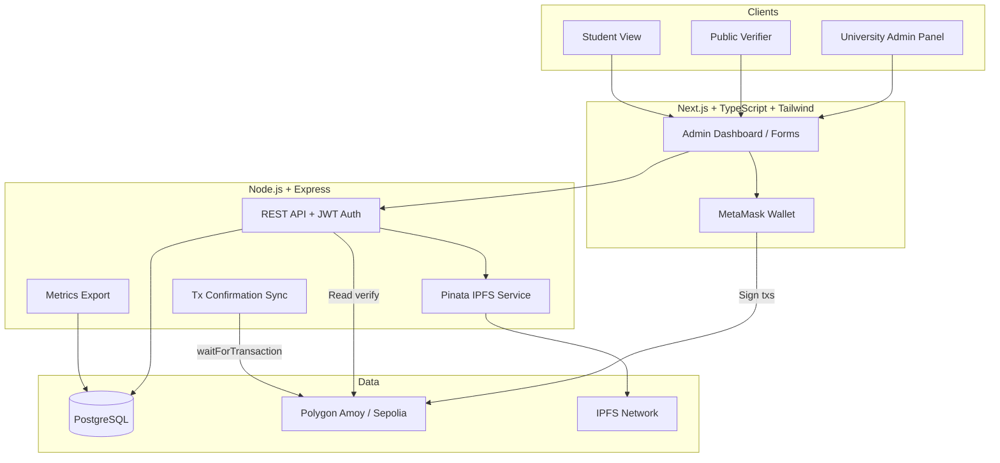

# Revocable Blockchain-Based Academic Certificate Management System (TrustCert)

A full-stack research prototype demonstrating **complete academic certificate lifecycle management** on blockchain: issue, verify, revoke, replace, and immutable audit trails.

## Architecture



## Monorepo Structure

```
├── contracts/          # Solidity + Hardhat
├── backend/            # Express API + PostgreSQL
├── frontend/           # Next.js UI
├── docs/               # API docs, sample data, metrics export
└── scripts/            # Setup helpers
```

## Certificate Lifecycle

| Status | Meaning |
|--------|---------|
| `ACTIVE` | Valid, current certificate |
| `REVOKED` | Invalid; reason stored on-chain |
| `REPLACED` | Superseded by a newer certificate ID |
| `SUPERSEDED` | Older version in a replacement chain |

```
ACTIVE ──revoke──► REVOKED
  │
  └──replace──► REPLACED ──► new ACTIVE (v+1)
                      └── earlier versions → SUPERSEDED
```

## Tech Stack

- **Smart contracts:** Solidity 0.8.24, OpenZeppelin AccessControl, Hardhat
- **Blockchain:** Polygon Amoy (80002) or Ethereum Sepolia (11155111)
- **Backend:** Node.js, Express, PostgreSQL, ethers.js, JWT
- **Frontend:** Next.js 14, TypeScript, Tailwind CSS, MetaMask
- **Storage:** Pinata IPFS for PDF certificates

## Prerequisites

- Node.js 18+
- PostgreSQL 14+
- MetaMask browser extension
- Testnet MATIC/ETH for gas ([Polygon Amoy faucet](https://faucet.polygon.technology/))
- Pinata account (optional; mock CIDs used if not configured)

## Quick Start

### 1. Clone and install

```bash
cp .env.example .env
# Edit .env with your values

chmod +x scripts/setup-local.sh
./scripts/setup-local.sh
```

### 2. Database

```bash
createdb trustcert
npm run db:migrate
npm run db:seed
```

Default accounts after seed:
- Super Admin: `superadmin@trustcert.edu` / `Admin@123`
- University Admin: `admin@msu.edu` / `Admin@123`

### 3. Deploy smart contract

**Local development:**
```bash
# Terminal 1
cd contracts && npx hardhat node

# Terminal 2
cd contracts && npm run deploy:local
```

Copy `contractAddress` from `backend/src/config/deployment.json` into `.env`:
```
CONTRACT_ADDRESS=0x...
RPC_URL=http://127.0.0.1:8545
CHAIN_ID=31337
```

**Polygon Amoy testnet:**
```bash
# Add DEPLOYER_PRIVATE_KEY and AMOY_RPC_URL to .env
cd contracts && npm run deploy:amoy
```

### 4. Register university on-chain

1. Import deployer or super-admin wallet into MetaMask
2. Connect at Admin Dashboard
3. As Super Admin, call `registerUniversity(universityAdminWallet)` on the contract
4. Ensure DB `universities.admin_wallet` matches the registered MetaMask address

### 5. Run application

```bash
# Terminal: API
npm run dev:backend

# Terminal: Frontend
npm run dev:frontend
```

- Frontend: http://localhost:3000
- API: http://localhost:4000
- Public verify: http://localhost:3000/verify

## Frontend Pages

| Route | Description |
|-------|-------------|
| `/` | System overview |
| `/verify` | Public certificate verification + QR code |
| `/admin/login` | JWT admin login |
| `/admin/dashboard` | Analytics + certificate list |
| `/admin/issue` | Issue certificate form |
| `/admin/revoke` | Revoke certificate form |
| `/admin/replace` | Replace certificate form |
| `/certificates/[id]` | Certificate details |
| `/certificates/[id]/history` | Audit trail timeline |
| `/student` | Student view-only lookup |

## Workflow (Issue Example)

1. Admin logs in → connects MetaMask (must match registered university wallet)
2. Fills issue form → backend uploads PDF to IPFS, returns hash + CID
3. Admin signs `issueCertificate(...)` in MetaMask
4. Frontend sends `txHash` to `/api/certificates/confirm`
5. Backend waits for confirmation → saves PostgreSQL record + audit log

Revoke and replace follow the same **prepare → sign → confirm** pattern.

## Smart Contract Functions

- `registerUniversity(address)` — Super Admin only
- `issueCertificate(...)` — University Admin
- `revokeCertificate(id, reason)` — active certs only
- `replaceCertificate(oldId, newId, ...)` — links versions, marks old as REPLACED
- `verifyCertificate(id)` — public view
- `getCertificateHistory(id)` — version chain

## Research Metrics

Gas usage and timing are recorded per transaction. Export for paper analysis:

```bash
cd backend && node src/scripts/captureMetrics.js csv
```

Output: `docs/metrics/metrics-<timestamp>.csv`

## Testing

```bash
# Smart contract tests
npm run test:contracts

# API tests (requires PostgreSQL)
npm run test:backend
```

## Environment Variables

See [.env.example](.env.example) for all options.

Key variables:
- `DATABASE_URL` — PostgreSQL connection
- `JWT_SECRET` — Admin authentication
- `CONTRACT_ADDRESS`, `RPC_URL`, `CHAIN_ID` — Blockchain
- `PINATA_API_KEY`, `PINATA_SECRET_API_KEY` — IPFS uploads

## API Documentation

See [docs/API.md](docs/API.md).

## Sample Data

Sample certificate metadata: [docs/sample-certificates.json](docs/sample-certificates.json)

## Security Notes

- Admin endpoints require JWT; privileged blockchain actions require matching MetaMask wallet
- Inputs validated with `express-validator`
- Revoked/replaced certificates remain on-chain for audit (not deleted)
- Use strong `JWT_SECRET` and never commit `.env`

## License

MIT — Academic research prototype.
